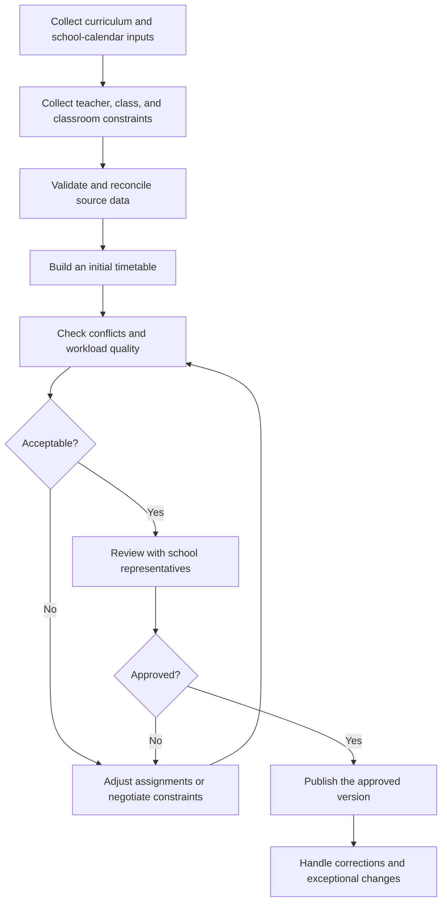

# Scheduling Process Model

## Status

- **Evidence level:** Hypothesis
- **Validation owner:** Unassigned school-side requirements owner
- **Last updated:** 2026-07-13

This document is a structured starting point for an interview. It is not a claim about a particular school's current process.

## Proposed as-is workflow

The interview must confirm, reorder, add, or remove every step.

## Activities to validate

### 1. Collect stable inputs

Candidate inputs include:

- school days, shifts, and lesson periods;
- classes and split groups;
- subjects and weekly curriculum requirements;
- teacher assignments and contracted workload;
- classrooms, capacity, and specialized equipment;
- recurring unavailability and fixed lessons.

Questions: who owns each source, in what format is it supplied, and when does it become stable?

### 2. Collect preferences and exceptions

Candidate inputs include:

- teacher time preferences;
- maximum or minimum lessons per day;
- subject sequencing preferences;
- difficult-subject limits;
- class or teacher gap preferences;
- one-off events and calendar exceptions.

Questions: which requests are guaranteed, negotiable, or informal, and who resolves conflicts between them?

### 3. Reconcile source data

Potential checks include missing teacher assignments, inconsistent lesson counts, unavailable specialized rooms, contradictory fixed lessons, and insufficient capacity.

Questions: how are problems reported, who corrects them, and is incomplete data ever accepted?

### 4. Create and improve the timetable

The scheduler may place the most constrained lessons first, reuse a prior timetable, or iterate from class-level schedules. The real strategy must be observed rather than inferred.

Questions: which assignments are made first, what tools are used, and which trade-offs consume the most time?

### 5. Review and approve

Candidate reviewers include school administrators, department representatives, and teachers.

Questions: is approval formal, which reports are reviewed, and what prevents publication when problems remain?

### 6. Publish and maintain

Candidate outputs include spreadsheet workbooks, printed sheets, messaging channels, websites, or school-information systems.

Questions: what is the source of truth, how are versions labeled, and how are urgent corrections communicated?

## Proposed roles

| Role | Proposed responsibility | Evidence |
| --- | --- | --- |
| Scheduler | Collect inputs, create variants, resolve conflicts, and prepare a candidate timetable. | Hypothesis |
| Requirements owner | Approve process rules, priorities, and Stage 1 outputs. | Required, unassigned |
| School administrator | Approve the timetable for publication. | Hypothesis |
| Department representative | Verify subject allocation and teacher-specific constraints. | Hypothesis |
| Data provider | Maintain one or more authoritative source datasets. | Hypothesis |
| Teacher | Submit availability or preferences and review relevant output. | Hypothesis |
| Timetable reader | Consume an approved view without editing it. | Hypothesis |

One person may perform several roles. Interviews must capture roles, not assume job titles.

## Exception paths to investigate

- A teacher or classroom becomes unavailable after an initial schedule is built.
- Curriculum hours change during planning.
- Two authoritative inputs contradict each other.
- A required lesson has no feasible teacher, room, or slot.
- A class must be divided differently for different subjects.
- Several classes share one teacher or one combined lesson.
- A school event shortens a day or changes lesson times.
- The timetable is acceptable overall but rejected due to one stakeholder preference.
- An approved timetable must be corrected without rebuilding everything.

For each real exception, capture trigger, frequency, current workaround, decision owner, acceptable response time, and whether it belongs in the MVP.

