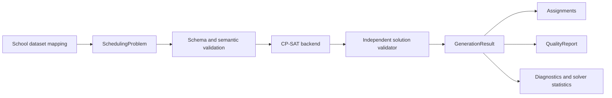

# Scheduling Core

## Status

- **Roadmap stage:** Stage 5, complete
- **Public API version:** 0.2.0
- **Backend:** OR-Tools CP-SAT 9.15.6755
- **Input schema:** 0.1.0

The scheduling core provides a stable, typed boundary around input canonicalization, generation options, the current solver backend, independent result validation, diagnostics, and quality reporting.

## Architecture



Application code imports types from `schedule_generator`, not from the CP-SAT prototype module. OR-Tools is imported lazily only when generation starts. `SchedulingProblem` stores a canonical immutable JSON representation and SHA-256 fingerprint, so a backend receives a fresh mapping and cannot mutate the caller's input.

The current backend remains replaceable behind `generate_schedule`. A future backend interface can formalize multiple implementations without changing the public result contract.

## Python API

```python
import json
from pathlib import Path

from schedule_generator import (
    GenerationOptions,
    SchedulingProblem,
    generate_schedule,
)

dataset = json.loads(Path("examples/small-school.json").read_text(encoding="utf-8"))
problem = SchedulingProblem.from_mapping(dataset)
options = GenerationOptions(time_limit_seconds=10, seed=1, workers=1)
result = generate_schedule(problem, options)

if result.is_success:
    print(result.status, len(result.assignments), result.quality.total_penalty)
else:
    for diagnostic in result.diagnostics:
        print(diagnostic.code, diagnostic.message)
```

For reproducible runs, callers must preserve the dataset fingerprint, core version, solver version, seed, worker count, and time limit. One search worker is the deterministic default.

## Command-line interface

```powershell
$env:PYTHONPATH = "src"
python -m schedule_generator examples/small-school.json `
  --output generation-result.json `
  --time-limit 10 `
  --seed 1 `
  --workers 1
```

The CLI returns exit code 0 for `OPTIMAL` or `FEASIBLE`, 1 for a completed but unsuccessful generation result, and 2 for command-line or JSON-reading errors.

## Public types

- `SchedulingProblem`: canonical solver-neutral input with dataset ID, schema version, and fingerprint.
- `GenerationOptions`: validated time limit, seed, and worker count.
- `GenerationStatus`: stable outcome enumeration.
- `GenerationResult`: assignments, quality, diagnostics, validation errors, and solver statistics.
- `LessonAssignment`: one selected requirement occurrence.
- `QualityReport`: total penalty, per-constraint totals, and concrete violations.
- `Diagnostic`: machine-readable code, human-readable message, and structured details.

All result types are frozen dataclasses. `GenerationResult.to_dict()` produces a JSON-compatible representation for APIs, files, and future job storage.

## Generation lifecycle

1. Canonicalize the input and calculate its fingerprint.
2. Validate the dataset against JSON Schema and semantic invariants.
3. Precompute legal occurrence candidates.
4. Return `INPUT_INFEASIBLE` immediately if an occurrence has no legal candidate.
5. Build and solve the CP-SAT model within explicit limits.
6. Extract assignments only for feasible solver statuses.
7. Validate the selected timetable independently.
8. Return `INVALID_SOLUTION` if independent validation fails.
9. Aggregate raw and weighted penalties into the quality report.
10. Return typed diagnostics and solver statistics.

## Quality report

For each enabled soft constraint, the report contains:

- total raw penalty units;
- total weighted penalty;
- every non-zero violation with its description, value, weight, and cost;
- the overall weighted penalty.

The report is explanatory, not a claim that the current weights are school-approved. Stage 1 and Stage 2 remain open until a requirements owner validates the policies.

## Guarantees and current boundaries

The core currently guarantees:

- input validation before solver construction;
- explicit run parameters and a dataset fingerprint;
- time-limited search with best feasible result support;
- no assignments returned for invalid, infeasible, or unknown outcomes;
- independent checking of selected hard constraints;
- structured quality and diagnostic output;
- backward compatibility for the Stage 4 prototype CLI.

Current limitations remain documented in the [solver prototype](../solver-prototype/README.md). In particular, the backend is still the candidate-based CP-SAT implementation, lexicographic priority tiers are not implemented, and real school data has not validated the model.

## Verification

The test suite covers:

- typed successful results and fixed lessons;
- quality-report totals;
- canonical fingerprints independent of mapping key order;
- invalid option rejection;
- invalid dataset diagnostics;
- input infeasibility before search;
- reproducible assignments and quality for repeated one-worker runs;
- the independent semantic dataset validator.
